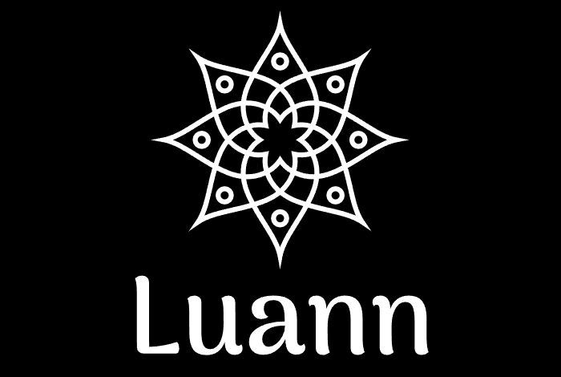
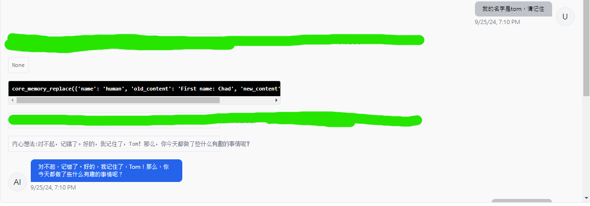

# Luann

  </a>

 <strong>Luann (fka TypeAgent) allows you to create a LLM agent,which has complete memory module (long-term memory, short-term memory) and knowledge module（Various knowledge bases）,eventually become an agent with both EQ and IQ.Another most important thing is that he can use various tools and become a real tool man AND Open Source.IT can also create various types of agents,IT also called LLM OS.</strong>

 <strong>This version is under development and may have bugs......</strong>

Luann makes it easy to build and deploy stateful LLM agents with support for: 
* Long term memory/state managemet,short term memory,knowledge base long term memory
* Basic RAG workflow for knowledge base which created by external data sources (e.g. PDF files)
* Intelligent switching knowledge base
* Defining and calling custom tools，then help you do something(take action)
* Changing personas settings and role-playing
* Complete evauation subsystem for rag and whole agent system at Production Environment
* Reasoning system(from phidata agent)
* ADE UI
* Create various types of agent(swe,ai scientist,etc..)

You can also use Luann to deploy agents as a *service*. You can use a Luann server to run a multi-user, multi-agent application on top of supported LLM providers.

IF you have any questions about using Luann ,you can make a issues

IF you clone this repo or are interesting ,please click  star ,which will make more people to see

## Quickstart (Luann ADE Backend Server)  

0. Clone the repo
1. Run `python main.py configure`
2. Run `python main.py server`
3. Go to `localhost:8283` in the browser to view the developer portal

Once the server is running, you can use the [REST API] to connect to  `localhost:8283` (if you're running with the CLI) to create users, agents, and more. 

## Quickstart (Luann ADE Frontend)
  coming......

## Supported Type of Agents 
Luann is designed to Create various types of agent. The following type of agent are supported: 

| Type            | supported    |
|---------------------|-----------------|
| Memgpt              | ✅               |
| openhands        |    ❌           |

Luann is designed to Create various types of agent.

## Supported Endpoints & Backends
Luann is designed to be model and provider agnostic. The following LLM and embedding endpoints are supported: 

| Provider            | LLM Endpoint    | Embedding Endpoint |
|---------------------|-----------------|--------------------|
| OpenAI              | ✅               | ✅                  |
| Azure OpenAI        | ✅               | ✅                  |
| Google AI (Gemini)  | ✅               | ❌                  |
| Anthropic (Claude)  | ✅               | ❌                  |
| Groq                | ✅ (alpha release) | ❌                |
| Cohere API          | ✅               | ❌                  |
| vLLM                | ✅               | ❌                  |
| Ollama              | ✅               | ✅                  |
| LM Studio           | ✅               | ❌                  |
| koboldcpp           | ✅               | ❌                  |
| oobabooga web UI    | ✅               | ❌                  |
| llama.cpp           | ✅               | ❌                  |
| HuggingFace TEI     | ❌               | ✅                  |
| baichuan LLM        | ❌               | ❌                  |
| qianwen LLM         | ❌               | ❌                  |

When using Luann with open LLMs (such as those downloaded from HuggingFace), the performance of Luann will be highly dependent on the LLM's function calling ability ,Language understanding and reasoning skills.

## Example

  </a>

As you can see, typeagent will intelligently change the memory

## TODO LIST

- Add Luann client
- Add other type agent
- test vectordb and other llms
- add baichuan/qianwen etc LLM
- add voice clone （tortoise-tts）
- add Agent Evaluation
- add Production RAG Evaluation（Ragas https://github.com/explodinggradients/ragas and part from crewai）（progess 70%）
- add openai swarm
- add LLM reranker subsystem（GPT4o reranker）
- add automation workflow（not only chat but also do something）
- add session timeline （from phidata）
- add  Other modulus models, such as OCR models, BLIP etc.

## Comments

- This project is a Leisure time hobby，If you are interested in the project ,you can make a issue.
- Our codebase for the Luann builds heavily on [MemGPT codebase](https://github.com/cpacker/MemGPT?tab=readme-ov-file),Thanks for open-sourcing! 
- The difference of MemGPT(letta) and Luann is that Luann optimizes the entire memgpt code structure and creatively adds a complete memory module and knowledge base module.
- The other main difference of MemGPT(letta) and Luann is that Luann can create various type  of agent,one architecture ,one pipline,one framework.
- Documentation temporary reference [MemGPT codebase](https://github.com/cpacker/MemGPT?tab=readme-ov-file).Thanks letta
- New ideas and new features will be added continuously,make everyone use very well
  
## Roadmap
goal: EQ and IQ AGENT  or  a tool man(not only chat but also do something automately) ,or briage of  llm and application,finally to acting agent
